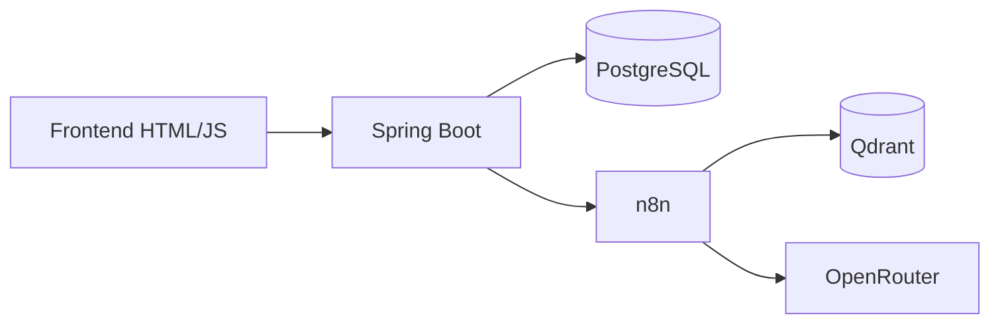

# Arquitectura

```mermaid
flowchart LR
    F[Frontend HTML/JS] --> S[Spring Boot]
    S --> P[(PostgreSQL)]
    S --> N[n8n]
    N --> Q[(Qdrant)]
    N --> O[OpenRouter]
```

El frontend solo se comunica con Spring Boot. Spring Boot valida las fuentes contra PostgreSQL antes de guardar cada recomendacion.