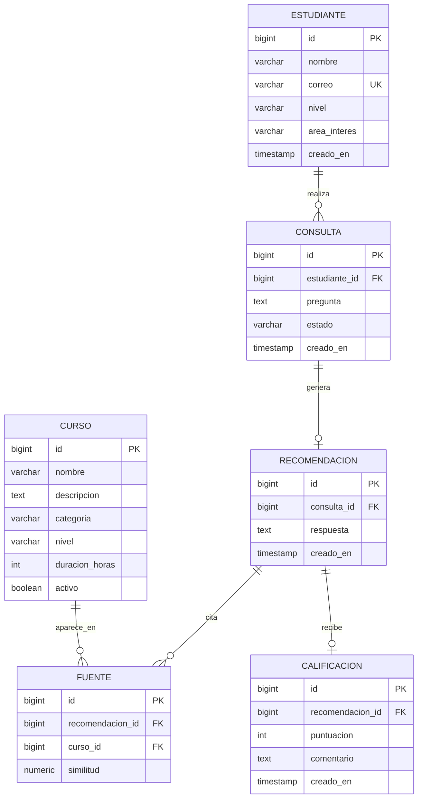

# Diagrama entidad-relacion

```mermaid
erDiagram
    ESTUDIANTE ||--o{ CONSULTA : realiza
    CONSULTA ||--o| RECOMENDACION : genera
    RECOMENDACION ||--o{ FUENTE : cita
    CURSO ||--o{ FUENTE : aparece_en
    RECOMENDACION ||--o| CALIFICACION : recibe
    ESTUDIANTE {
        bigint id PK
        varchar nombre
        varchar correo UK
        varchar nivel
        varchar area_interes
        timestamp creado_en
    }
    CURSO {
        bigint id PK
        varchar nombre
        text descripcion
        varchar categoria
        varchar nivel
        int duracion_horas
        boolean activo
    }
    CONSULTA {
        bigint id PK
        bigint estudiante_id FK
        text pregunta
        varchar estado
        timestamp creado_en
    }
    RECOMENDACION {
        bigint id PK
        bigint consulta_id FK
        text respuesta
        timestamp creado_en
    }
    FUENTE {
        bigint id PK
        bigint recomendacion_id FK
        bigint curso_id FK
        numeric similitud
    }
    CALIFICACION {
        bigint id PK
        bigint recomendacion_id FK
        int puntuacion
        text comentario
        timestamp creado_en
    }
```